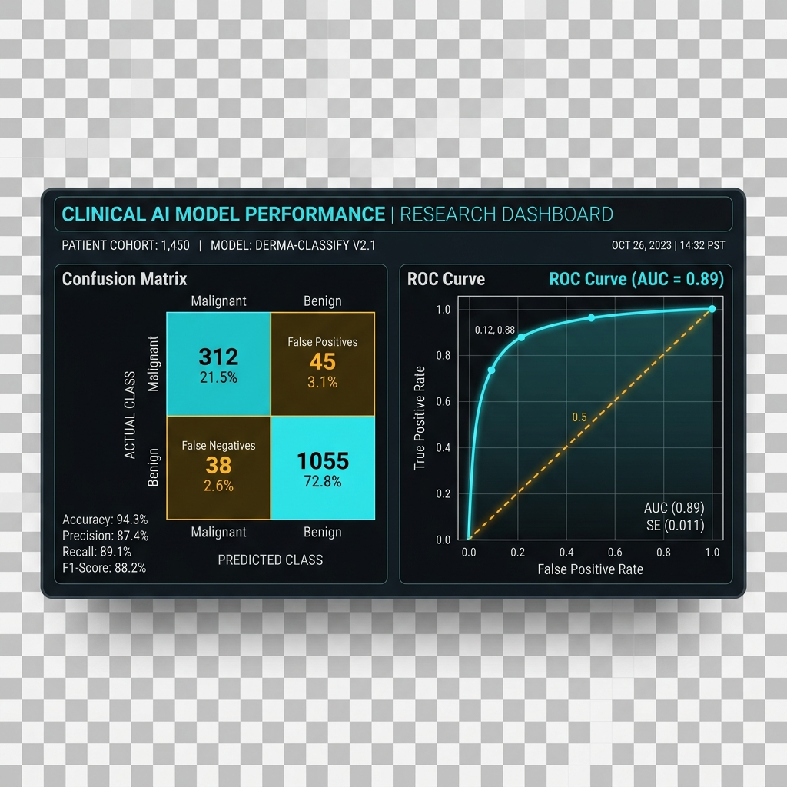

# 🫀 Pulse AI: Heart Disease Classification System

### Clinical Decision Support System (CDSS) — Deep Technical & Business Prototype

Pulse AI is a web-based clinical tool designed to assist healthcare professionals in predicting heart disease risk. Using a Random Forest classifier and Explainable AI (SHAP), it provides not just a prediction, but a transparent explanation of the clinical factors driving the risk assessment.



## 🚀 Key Features

- **AI Risk Prediction:** Calculates heart disease probability (0–100%) using a Random Forest model.
- **Explainable AI (XAI):** Visualizes which clinical factors (e.g., cholesterol, blood pressure) influenced the result using SHAP values.
- **Personalized Recommendations:** Provides tailored dietary (vegan-optimized), exercise, and clinical action plans based on risk tiers.
- **PDF Report Generation:** Instantly generates professional clinical reports for patients.
- **Synthetic Patient Simulation:** Includes GAN-based (CTGAN/TVAE) simulation for generating realistic test cases.
- **Privacy-First:** All patient history is stored locally in the browser (`localStorage`). No data is sent to a central server.

## 🛠️ Tech Stack

- **Backend:** Flask (Python)
- **Machine Learning:** Scikit-learn (Random Forest), Pandas, NumPy
- **Explainability:** SHAP (SHapley Additive exPlanations)
- **Generative AI:** SDV (CTGAN & TVAE) for synthetic data
- **Frontend:** HTML5, Vanilla CSS (Glassmorphic Design), Vanilla JS, Chart.js
- **Reporting:** ReportLab (PDF Generation)

## 📦 Installation & Setup

1. **Clone the repository:**
   ```bash
   git clone https://github.com/sri872/heart-disease-classification.git
   cd heart-disease-classification
   ```

2. **Create a virtual environment:**
   ```bash
   python -m venv .venv
   source .venv/bin/activate  # On Windows: .venv\Scripts\activate
   ```

3. **Install dependencies:**
   ```bash
   pip install -r requirements.txt
   ```

4. **Run the application:**
   ```bash
   python app.py
   ```
   The app will be available at `http://127.0.0.1:5001`.

## 🔐 Authentication (Demo)
- **Physician ID:** `physician_01`
- **Password:** `pulse2026`

## 📊 Dataset
The model is trained on the **UCI Heart Disease Dataset**, augmented with synthetic data generated via CTGAN and TVAE to improve robustness and demonstration capabilities.

## ⚠️ Disclaimer
This project is an **academic prototype** for demonstration purposes only. It is not FDA/CE approved and should not be used for real clinical diagnosis or treatment decisions.

---
*© 2026 Pulse AI. For Academic and Professional Review Only.*
